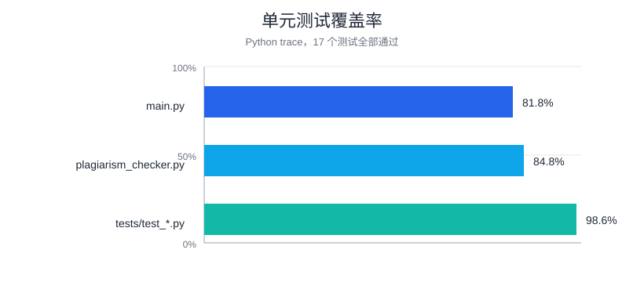

# 单元测试覆盖率记录

使用 Python 标准库 `trace` 运行 20 个单元测试（包含两个命令行入口测试）：

```text
python -m trace --count --summary --missing -C coverage --module unittest discover -s tests -v
```

本次运行的项目文件覆盖率：



| 文件 | 覆盖率 |
|---|---:|
| `main.py` | 81.0% |
| `main_clean.py` | 65.2% |
| `github_html_reader.py` | 100.0% |
| `plagiarism_checker.py` | 87.3% |
| `tests/test_plagiarism_checker.py` | 99.0% |

未覆盖行主要是“直接以脚本启动 `main.py`”的保护分支和专门构造错误类型的参数防御分支；它们不影响正常评测路径。博客中可将 `coverage/` 目录中的 `.cover` 文件或本页截图作为覆盖率展示。
