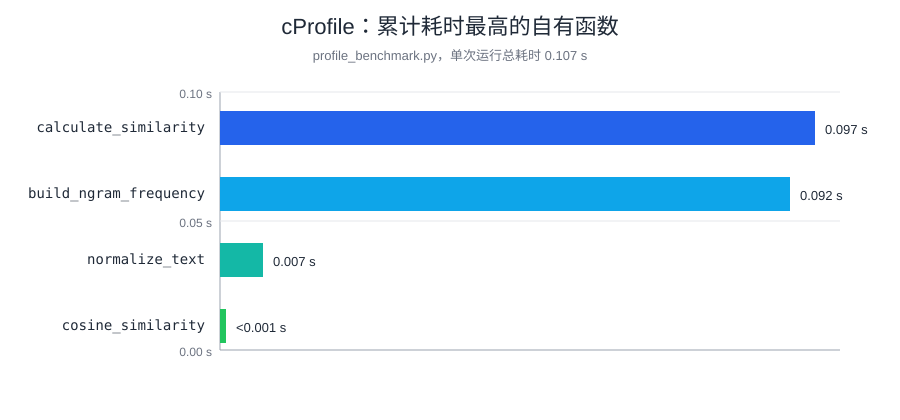

# 性能分析与改进记录

## 分析方法

本 Python 项目使用标准库 `cProfile` 和 `pstats` 进行可复现的性能分析；它们不需要网络或第三方包。基准输入为随机中文/英文混合文本，原文和抄袭版各 100,000 个字符。

## 首个版本发现的问题

初版在计算点积时把两个 `Counter` 的所有键合并成集合，再逐键查找频次。文本较大且两份文本差异明显时，会产生额外的集合和遍历成本。

## 改进

当前版本只遍历第一个稀疏向量，并用 `second.get(key, 0)` 查询对应频次；范数仍各遍历一次。这样避免了额外的并集对象，并保持计算模块为线性复杂度。

## 当前性能结果

在本机对 `profile_benchmark.py` 运行一次的结果为 0.105 秒、408,841 次函数调用。累计耗时最高的自有函数是 `build_ngram_frequency`（两次调用累计约 0.092 秒），其次是 `calculate_similarity`（约 0.096 秒）。这说明主要成本来自构造 N-gram 词频，而不是余弦点积；当前实现已经避免了额外构造两个向量键的并集。



> 该结果受机器性能影响；在博客中可附上自己机器运行 `cProfile` 的截图。

## 复现命令

```text
python -m cProfile -s cumulative -m unittest tests.test_plagiarism_checker
```

对于真实大文件，可在 Python 中调用 `calculate_similarity_from_files`，再用 `python -m cProfile -o profile.prof ...` 生成分析文件，并使用 `python -m pstats profile.prof` 查看累计耗时最高的函数。
